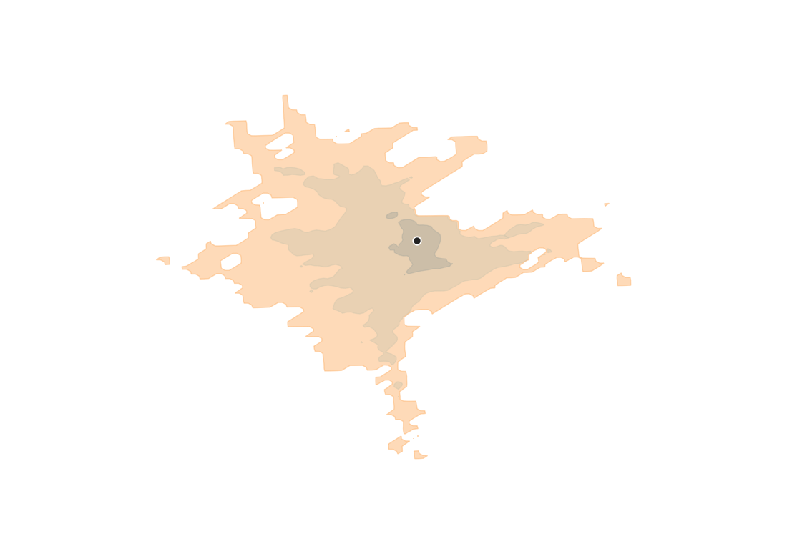

# Easy-R5

A QGIS processing plugin for transit accessibility analysis on the
[**Conveyal R5**](https://github.com/conveyal/r5) routing engine — travel-time matrices,
cumulative-opportunity accessibility and isochrones over a departure-time window, computed inside
QGIS with no R, no conda and no Docker.

> **Status: 0.1.0, experimental.** All eight algorithms work; the travel-time matrix and
> accessibility are verified end-to-end (accessibility reproduces r5r's Gdańsk output
> *exactly* — [`docs/notes/validation-gdansk.md`](docs/notes/validation-gdansk.md)). The flag
> stays `experimental` until a clean-install run of the full pipeline is signed off. See
> [`KNOWN_ISSUES.md`](KNOWN_ISSUES.md).

Sibling project: [**easy-OTP**](https://github.com/GISBoost/easy-OTP), the same idea on
OpenTripPlanner 1.5.

| | easy-OTP | Easy-R5 |
|---|---|---|
| Engine | OpenTripPlanner 1.5 (Java 8) | Conveyal R5 (Java 21) |
| Best at | per-minute travel-time surfaces, detailed itineraries, **live GTFS-RT** | one-to-many / many-to-many travel times over a **departure-time window**, cumulative accessibility |
| Realtime | yes — records GTFS-RT and reconstructs realized feeds | no — R5 cannot read GTFS-RT; it consumes the realized static feeds easy-OTP produces |

The two are designed to share data: the same OSM extracts, GTFS feeds and hex grids work in
both.

---

## What it does

Processing toolbox → **Easy-R5**:

| Group | Algorithm | Does |
|---|---|---|
| Setup | **Download R5 engine and Java 21** | fetches Temurin 21 + `r5-v7.6-all.jar` (SHA-256 pinned), compiles the runner. No admin rights. |
| Setup | **Build R5 network** | one `.osm.pbf` + a folder of GTFS `.zip` → cached `network.dat` + a `network.json` summary with a per-date active-trip count. |
| Diagnostics | **Test R5 setup** | checks the JDK, jar and runner independently. |
| Analysis | **Run travel time matrix** | N origins × M destinations, percentiles over a departure window, batched processes, sampled time estimate, hard dead-date gate + post-run walk-only detector. Long CSV out. |
| Analysis | **Run accessibility** | opportunities reachable per origin / cutoff / percentile (STEP / LOGISTIC / EXPONENTIAL decay), summed in Python from the matrix. Long CSV + an ORIGINS copy with `acc_<opp>_p<pct>_c<cutoff>` fields. |
| Analysis | **Generate isochrones** | cumulative travel-time polygons, one per (origin, cutoff): a destination grid → one-origin matrix → TIN raster → `gdal:contour_polygon` per cutoff (the approach r5r/r5py/Conveyal all use — R5 has no isochrone output). Unreachable pockets stay as holes. |
| Analysis | **Prepare population layer** | joins a GUS NSP 2021 sheet to census-tract geometry. |
| Analysis | **Population overlay** | area-weighted population onto a hex grid (fractional, not rounded). |

Isochrones are contoured **in QGIS** — R5 has no isochrone output (neither does r5r's or
r5py's engine call; both grid-and-contour, like this). There is no hex-grid
algorithm: use stock `native:creategrid` (recipe below).

See [`docs/notes/product-scope.md`](docs/notes/product-scope.md) and
[`docs/notes/r5-vs-otp.md`](docs/notes/r5-vs-otp.md) for what is deliberately *not* here
(scenarios, itineraries, GTFS-RT, the service-minutes metric — all v0.2+).

## Quick start

1. **Install** — Easy-R5 is not yet in the QGIS plugin repository. Either copy the
   `easy_r5/` folder into your QGIS profile's `python/plugins/`, or build a ZIP from a
   checkout (`py tools/build_plugin_zip.py` → `builds/easy_r5-<version>.zip`) and use
   *Plugins → Manage and Install → Install from ZIP*. Then enable it.
2. **Download the engine** — run *Setup → Download R5 engine and Java 21*, pick a target folder
   in your user profile. One-time, ~200 MB (Temurin 21 JDK + the R5 jar).
3. **Get data** — you supply the OSM extract (`.osm.pbf` from [Geofabrik](https://download.geofabrik.de/)
   or [BBBike](https://extract.bbbike.org/)) and the GTFS feed(s) (`.zip`) for your study area.
   For a *realized* feed (what actually ran on a given day, P50/P85) or that day's scheduled
   feed, see **Archival / realized GTFS** below.
4. **Build a network** — *Setup → Build R5 network*: the `.osm.pbf` and a folder holding your
   GTFS `.zip`(s). Cached by content hash + R5 version, so re-runs are instant.
5. **Analyse** — *Run travel time matrix* or *Run accessibility*: the network from step 4, an
   origins point layer, a destinations point layer, a `DATE` the feed actually serves (the run
   is blocked otherwise), a departure time and window. Output layers are styled automatically.

The Gdańsk reference data — 1389 origins, 956 destinations, the r5r ground-truth output — is in
[`tools/accessibility_cities/gdansk/`](tools/accessibility_cities/gdansk/); the exact-match
comparison is in [`docs/notes/validation-gdansk.md`](docs/notes/validation-gdansk.md).

## Archival / realized GTFS

*Setup → Download realized GTFS*, or **Plugins → Easy-R5 → Download transit recordings…**
for a pick-from-a-list dialog, fetches a feed from
[GISBoost's gtfs-dashboard](https://gisboost.github.io/gtfs-dashboard/) — the index of
recordings produced by the [`easy-GTFS-RT`](https://github.com/GISBoost/easy-GTFS-RT)
pipeline for ~25 cities on specific days. Pick a city, a day, and a variant:

- **Realized P50 / P85** — the timetable rewritten to match what vehicles actually did that
  day (median, or the conservative 85th percentile). This is the *only* way realtime
  information enters Easy-R5; R5 does not read GTFS-RT.
- **Scheduled** — the static GTFS as published for that day.

It downloads into `…/transit-recordings/<city>/<date>/<variant>/`, ready to hand to
*Build R5 network*. Realized and scheduled feeds share trip / stop ids, so each variant gets
its own folder. This is **not** a general GTFS source — for feeds outside GISBoost's
recordings, download from the operator or [Mobility Database](https://mobilitydatabase.org/).
No checksum is published for these assets, so the download is CRC-checked and sniffed for the
GTFS files, nothing stronger.

## Hex grid — use stock QGIS

Easy-R5 ships no hex-grid algorithm. To reproduce `gdansk_hex_origins.csv`'s layout:

1. **Processing → `native:creategrid`** — `TYPE = Hexagon`, `HSPACING = VSPACING = 500`
   (metres), `GRID EXTENT` = your study area, `GRID CRS` = a metric CRS (e.g. EPSG:2180).
2. **`native:extractbylocation`** — keep only hexes that *are within* / *intersect* the
   study-area boundary.
3. **`native:centroids`** — the origin points; add an `id` field with the Field Calculator
   (`@row_number` or a stable code) and export `id,lon,lat` after reprojecting to EPSG:4326.

(See `tools/accessibility_cities/HOWTO_MANUAL.md` step 4.)

## Repository layout

| Path | What it is |
|---|---|
| `easy_r5/` | the QGIS plugin |
| `easy_r5/java/EasyR5Runner.java` | the one Java source file that drives R5 (`build`, `matrix`) |
| [`CONTEXT.md`](CONTEXT.md) | glossary — the words this project uses |
| [`docs/adr/`](docs/adr/) | architecture decisions |
| [`docs/notes/`](docs/notes/) | engine primer, binding comparison, scope, migration plan, open questions |
| [`tools/`](tools/README.md) | standalone R5 research tooling — accessibility and isochrone studies for 7 Polish cities, migrated from easy-OTP ([ADR-0003](docs/adr/0003-migrate-r5-tools.md)). Gdańsk is the plugin's reference dataset. |

## Requirements

| Requirement | Version | How to get it |
|---|---|---|
| QGIS | 3.22 LTR or newer (developed on 3.40) | qgis.org — the plugin uses the bundled Python and GDAL |
| Java | **21** (Temurin) | *Download R5 engine and Java 21* fetches it |
| R5 | **pinned** `r5-v7.6-all.jar` — see [ADR-0002](docs/adr/0002-pinned-versions.md) | same algorithm, SHA-256 verified |
| OSM extract | any `.osm.pbf` covering the study area | you supply it (Geofabrik, BBBike) |
| GTFS feed(s) | any valid feed | you supply it (the operator, transitfeeds, MobilityData) |
| `openpyxl` (optional) | 3.1.5 | **only** *Prepare population layer* / *Population overlay* need it. The plugin fetches the pure-Python wheel from PyPI (SHA-256 verified, no `pip`) on first load; if that fails it prints a one-line manual-install hint. Every other algorithm works without it. |

## Licence

GPL-3.0-or-later. R5 itself is MIT (© Conveyal LLC) and is downloaded, not vendored.

## Credits

R5 is developed by [Conveyal](https://www.conveyal.com/). This plugin is not affiliated with
Conveyal. The existing R bindings [`r5r`](https://github.com/ipeaGIT/r5r) (IPEA) and
[`r5py`](https://github.com/r5py/r5py) are not dependencies here, but `r5py`'s source was the
reference for how R5's Java API is used — credit where it is due.
