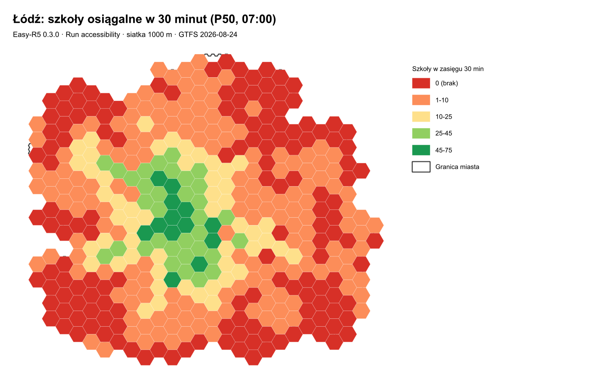
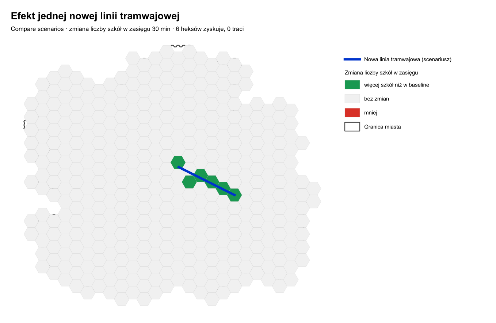
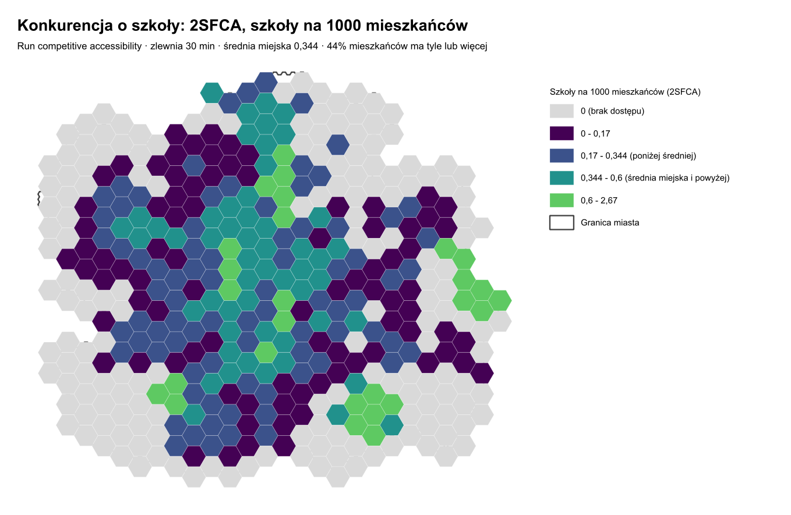

# Demo v0.3 — Łódź: kontrola GTFS, scenariusz, 2SFCA, równość dostępu

Żywy przykład **wszystkich algorytmów dodanych w 0.3.0**, policzony na realnej sieci Łodzi.
Wszystko zrobione samą wtyczką Easy-R5 + natywnymi algorytmami QGIS, bez dodatkowych narzędzi.

**Pytanie badawcze:** *ilu mieszkańców Łodzi dojedzie transportem zbiorowym do szkoły w 30 minut,
gdzie jest najgorzej, co zmieniłaby jedna nowa linia tramwajowa i czy szkół starcza dla tych,
którzy do nich dojeżdżają.*

| Plik | Co to |
|---|---|
| `demo_v03_lodz.qgz` | projekt QGIS z warstwami pogrupowanymi wg etapów analizy |
| `demo_v03_lodz.gpkg` | wszystkie warstwy i tabele wynikowe (ze stylami) |
| `scenariusz_tramwaj.json` | plik scenariusza z *Build scenario* |
| `out/` | raporty HTML, CSV-e wynikowe i `*.meta.json` z metodą przebiegu |

Dane i wyniki są w `.gitignore` (repo wersjonuje kod i dokumentację, nie dane) — ten plik opisuje,
jak je odtworzyć.

---

## 0. Czego potrzebujesz

Wszystko pochodzi z wcześniejszych analiz w `tools/`, nic nie trzeba pobierać:

- sieć R5: `tools/f1_smoke_test_lodz/network_cache/be51f7842a53a223/network.dat`
  (OSM Łodzi + `lodz_static_gtfs_2026-08-21`, ta sama sieć co w `tools/realtime_delay_lodz`);
- GTFS: `tools/realtime_delay_lodz/gtfs_static/lodz_static_gtfs_2026-08-21.zip`;
- dane wejściowe z `tools/realtime_delay_lodz/delay_lodz.gpkg`:
  - `hex_centroids` — siatka 500 m z populacją (4101 heksów, 669 972 mieszkańców, GUS NSP 2021
    rozłożone dazymetrycznie — patrz `tools/realtime_delay_lodz/README.md`),
  - `poi_targets` — 766 celów z OSM (311 szkół, 350 aptek, 47 uczelni, 58 galerii); warstwa
    obejmuje także okolicę poza granicą Łodzi — patrz krok 7,
  - `boundary` — granica miasta.

Wtyczka Easy-R5 włączona, silnik pobrany (*Setup → Download R5 engine and Java 21*).

**Data analizy: 2026-08-24** (poniedziałek, 9893 kursy) — sprawdzona w kroku 1.
**Odjazd 07:00, okno 120 minut, percentyl 50, próg 30 minut.**

---

## 1. Kontrola danych GTFS (*Check transit data*)

Zanim cokolwiek policzysz: czy w wybranym dniu w ogóle coś jeździ.

*Processing → Easy-R5 → Diagnostics → Check transit data (GTFS)*

| Parametr | Wartość |
|---|---|
| `GTFS` | `tools/realtime_delay_lodz/gtfs_static/lodz_static_gtfs_2026-08-21.zip` |
| `DATE` | `2026-08-24` |
| `OUTPUT_REPORT` | `out/kontrola_gtfs.html` |
| `OUTPUT_SERVICE_DAYS` | `out/kursy_na_dzien.csv` |
| `OUTPUT_ROUTES` | `out/linie.csv` |

**Wynik:** 0 błędów, 0 ostrzeżeń. Kalendarz 2026-08-20 → 2026-12-31, mediana 9893 kursów dziennie,
24 sierpnia 9893 kursy. 138 linii: 25 tramwajowych (`route_type` 0) i 113 autobusowych (3).
`out/linie.csv` to lista nazw linii — stąd bierzesz numery do usuwania/zmiany częstotliwości
w scenariuszu.

Obie tabele CSV są w projekcie w grupie **01 Kontrola GTFS**.

---

## 2. Przygotowanie warstw (natywne algorytmy QGIS)

Siatka 500 m dałaby 4101 źródeł; dla demo wystarczy **1000 m** (410 heksów, przebieg ~15 s zamiast
kilku minut). Populację przenosimy sumą z siatki 500 m.

1. **`native:creategrid`** — `TYPE = Hexagon`, `HSPACING = VSPACING = 1000`, `CRS = EPSG:2180`,
   `EXTENT` = zasięg warstwy `boundary`.
2. **`native:extractbylocation`** — zostaw tylko heksy przecinające `boundary`. → 410 heksów.
3. **`native:joinbylocationsummary`** — `JOIN` = `hex_centroids` (siatka 500 m),
   `JOIN_FIELDS = pop_total`, `SUMMARIES = sum`, predykat *intersects*.
4. **`native:fieldcalculator`** ×3 — `pop_total = coalesce("pop_total_sum", 0)`,
   `hex_id = 'h' || lpad(@row_number, 4, '0')` (tekstowy, stały klucz złączeń),
   `strefa = if(distance($geometry, make_point(534000, 434500)) <= 3000, 'centrum', 'obrzeza')`
   (3 km od Łodzi Fabrycznej — prosty podział do porównań w kroku 6).
5. **`native:retainfields`** — zostaw `hex_id`, `pop_total`, `strefa`; zapisz jako `hex_grid_1000m`.
6. **`native:centroids`** — `hex_centroids_1000m`, to są **źródła** analizy.
7. **`native:extractbyexpression`** — `"category" = 'school'` na `poi_targets` → `poi_schools`
   (311 szkół, pole `srv_school = 1` to „pojemność": jedna placówka).
8. **`native:extractbylocation`** (predykat *within*, `INTERSECT` = `boundary`) → `poi_schools_lodz`,
   **230 szkół leżących w granicach miasta**. To są cele dla 2SFCA — dlaczego, patrz krok 7.

Suma populacji na siatce 1000 m: **668 952** z 669 972 (0,15% wypada poza heksami przy granicy —
akceptowalne, ale trzeba to wiedzieć, zanim poda się liczby bezwzględne).

---

## 3. Dostępność wyjściowa — baseline (*Run accessibility*)

| Parametr | Wartość |
|---|---|
| `NETWORK` | `…/network_cache/be51f7842a53a223/network.dat` |
| `ORIGINS` / `ORIGIN_ID_FIELD` | `hex_centroids_1000m` / `hex_id` |
| `DESTINATIONS` / `DEST_ID_FIELD` | `poi_schools` / `poi_id` |
| `OPPORTUNITY_FIELDS` | `srv_school` |
| `CUTOFFS` | `30` |
| `DATE` / `DEPARTURE_TIME` / `TIME_WINDOW` | `2026-08-24` / `07:00` / `120` |
| `PERCENTILES` | `50` |
| `OUTPUT_CSV` / `OUTPUT_LAYER` | `out/acc_base.csv` / warstwa `acc_base` w GPKG |

Czas: **~15 s** (410 źródeł × 311 celów). Wynik: pole `acc_srv_school_p50_c30` — liczba szkół
osiągalnych w 30 minut. Maksimum 75 szkół; **51 zamieszkanych heksów ma zero**.



*(Rysunki w tym pliku to wydruki z QGIS-a: Widok → Nowy wydruk, mapa + legenda + tytuł, eksport do
PNG. W demo zrobił to skrypt przez API layoutu — efekt jest ten sam, co klikanie w oknie wydruku.)*

---

## 4. Scenariusz: nowa linia tramwajowa (*Build scenario*)

**Korytarz wybrany z danych, nie z wyobraźni.** W warstwie `acc_base` sortujemy heksy z
`acc_srv_school_p50_c30 <= 2` po populacji: na szczycie `h0319` — **6281 mieszkańców, zero szkół
w 30 minut**, 4,8 km od centrum (Janów/Olechów, 19,5548 / 51,7563). To jest miejsce, któremu nowa
linia ma pomóc.

1. **Warstwa liniowa.** *Warstwa → Utwórz warstwę → Nowa warstwa tymczasowa*, typ **LineString**,
   pole tekstowe `name`. Włącz edycję, *Dodaj obiekt liniowy*, klikaj **w miejscach przystanków**
   (każdy wierzchołek = przystanek), tu: od centroidu `h0319` do centrum, przystanki co ~800 m
   (7 przystanków na 4,79 km). Prawy klik kończy linię, nazwa `T-demo`, zapisz edycję.
   W projekcie leży to jako `scenariusz_linia_tramwajowa`.
2. **Build scenario** (*Easy-R5 → Scenarios*):

   | Parametr | Wartość |
   |---|---|
   | `NEW_LINES` / `LINE_NAME_FIELD` | `scenariusz_linia_tramwajowa` / `name` |
   | `NEW_LINE_MODE` | `TRAM` |
   | `SPEED_KMH` | `20` (prędkość po linii prostej) |
   | `HEADWAY_MINUTES` | `6` |
   | `SERVICE_START` / `SERVICE_END` | `05:00` / `23:00` |
   | `DWELL_SECONDS` | `25` |
   | `OUTPUT_SCENARIO` | `scenariusz_tramwaj.json` |

   Log wypisuje czas przejazdu całej linii — porównaj z podobną istniejącą linią, zanim pójdziesz dalej.
3. **Ten sam *Run accessibility* co w kroku 3**, z jedną różnicą: w *Parametrach zaawansowanych*
   `SCENARIO` = `scenariusz_tramwaj.json`. Wyjście: `out/acc_tram.csv`, warstwa
   `acc_scenariusz_tramwaj`. Czas ~20 s (o ~1,4× dłużej niż baseline — linia kursuje „co 6 minut",
   więc R5 losuje rozkłady, patrz README główne, sekcja o Monte Carlo).

Warstwy wynikowe mają pole `scenario` (`baseline` vs `scenariusz_tramwaj.json:<suma kontrolna>`),
więc nie da się ich później pomylić.

---

## 5. Porównanie przed/po (*Compare scenarios*)

*Easy-R5 → Scenarios → Compare scenarios*: `LAYER_A` = `acc_base`, `LAYER_B` =
`acc_scenariusz_tramwaj`, `JOIN_FIELD` = `hex_id`, `FIELD` = `acc_srv_school_p50_c30`,
`HIGHER_IS_BETTER` = tak. Wynik to punkty (centroidy), więc dorzucamy heksy:

**`native:joinattributestable`** — `INPUT` = `hex_grid_1000m`, `FIELD` = `hex_id`,
`INPUT_2` = wynik porównania, `FIELD_2` = `hex_id`, kopiowane pola: `value_a`, `value_b`, `diff`,
`pct_change`, `status`. → `porownanie_heksy`, stylizowane kategoriami `status`.

**Wynik:**

| | |
|---|---|
| Heksy, w których jest lepiej | **6** (mieszka w nich 23 157 osób) |
| Największy zysk | `h0319`: **0 → 18 szkół** w 30 minut |
| Kolejne | `h0280` 1 → 12, `h0261` 10 → 15, `h0300` 19 → 23 |
| Heksy, w których jest gorzej | 0 |



---

## 6. Równość dostępu (*Summarize accessibility equity*)

Mapa pokazuje *gdzie*; to pokazuje *ilu ludzi*. Uruchamiamy na obu warstwach dostępności:
`POPULATION_FIELD` = `pop_total`, `ACCESSIBILITY_FIELDS` = `acc_srv_school_p50_c30`,
`THRESHOLD` = `1` („co najmniej jedna szkoła"), `GROUP_FIELD` = `strefa`.

| Miara (ważona populacją) | Baseline | Scenariusz |
|---|--:|--:|
| Mieszkańcy z ≥ 1 szkołą w 30 min | **97,0%** (648 816) | **97,9%** (655 097) |
| Mieszkańcy bez żadnej szkoły | 3,01% (20 135) | **2,07% (13 855)** |
| Mediana mieszkańca (p50) | 26 szkół | 27 szkół |
| Gini dostępu | 0,377 | 0,368 |
| Centrum: bez dostępu | 0,06% | 0,06% |
| Obrzeża: bez dostępu | 3,72% | 2,55% |

Jedna linia tramwajowa zmniejsza grupę bez dostępu do szkoły o **6280 osób** — to dokładnie
populacja `h0319`. Zdanie do raportu: *„nowa linia wprowadza 6,3 tys. mieszkańców w zasięg 30 minut
od szkoły; udział bez dostępu spada z 3,0% do 2,1%, w całości na obrzeżach"*.

---

## 7. Dostępność konkurencyjna 2SFCA (*Run competitive accessibility*)

„97% ma szkołę w zasięgu" nie mówi, **ile tych szkół przypada na osobę**. 2SFCA dzieli każdą
szkołę między wszystkich, którzy do niej dojeżdżają.

| Parametr | Wartość |
|---|---|
| `ORIGINS` / `POPULATION_FIELD` | `hex_centroids_1000m` / `pop_total` |
| `DESTINATIONS` / `CAPACITY_FIELD` | `poi_schools_lodz` / `srv_school` (1 placówka) |
| `CATCHMENT_MINUTES` | `30` |
| `DECAY` | `STEP` (klasyczne 2SFCA) |
| `PERCENTILES` | `50` (jedna wartość) |
| `PER_POPULATION` | `1000` |
| wyjścia | `fca_punkty`, `fca_szkoly_obciazenie`, `out/fca.csv` |

Wynik łączymy z heksami (`native:joinattributestable`, pole `fca`) → `fca_heksy`.

**Wynik:** średnia miejska to 230 szkół / 668 952 mieszkańców = **0,344 szkoły na 1000 osób**.
Podsumowanie równościowe na polu `fca` z tym progiem:

| Miara | Wszyscy | Centrum | Obrzeża |
|---|--:|--:|--:|
| Udział mieszkańców z dostępem ≥ średnia miejska | **44,0%** | 82,1% | 34,8% |
| Mediana (p50) szkół na 1000 osób | 0,32 | 0,49 | 0,29 |
| Najgorsza dziesiąta część (p10) | 0,13 | 0,27 | 0,12 |
| Gini | 0,286 | 0,175 | 0,291 |

Czyli: **prawie każdy dojedzie do jakiejś szkoły, ale mniej niż połowa mieszkańców ma do dyspozycji
tyle placówek, ile wynosi średnia miejska** — i zależy to wyraźnie od tego, gdzie mieszka: w centrum
82%, na obrzeżach 35%. Warstwa `fca_szkoly_obciazenie` pokazuje to od strony placówek: najbardziej
oblegana szkoła ma w 30-minutowej zlewni **204 tys. mieszkańców**.

To jest inna skala niż liczba szkół z kroku 3 — nie porównuj tych liczb wprost.



Mapa czyta się inaczej niż ta z kroku 3: pas wzdłuż centrum ma dostęp na poziomie średniej miejskiej
albo wyżej (turkus i zieleń), a duże fragmenty osiedli mieszkaniowych są ciemne — dojadą do szkół,
ale konkurują o nie z resztą miasta.

### Pułapka, na którą natrafiliśmy: cele spoza obszaru źródeł

Pierwszy przebieg liczył wszystkie 311 szkół z warstwy POI, także te w Aleksandrowie Łódzkim,
Zgierzu i Pabianicach. Kilka heksów dostało wtedy absurdalne wartości — maksimum **4902 szkoły
na 1000 mieszkańców**. To nie był błąd algorytmu, tylko znany artefakt 2SFCA:

- szkoły w Aleksandrowie były w zasięgu 30 minut **wyłącznie** dla skrajnych, prawie pustych heksów
  na granicy miasta — łącznie **1,02 mieszkańca** w całej zlewni;
- krok 1 dzieli pojemność przez ten popyt: 1 szkoła / 1,02 osoby = 0,98 szkoły **na osobę**, czyli
  980 na 1000;
- heks `h0001` (1 mieszkaniec) dosięgał pięciu takich szkół → 5 × 980 = **4902**.

Przyczyna: **źródła nie obejmowały wszystkich, którzy konkurują o te szkoły** — mieszkańcy
Aleksandrowa i Zgierza nie byli w siatce, bo siatka kończy się na granicy Łodzi. Dwa poprawne
wyjścia: rozszerzyć źródła poza granicę miasta (potrzebna populacja dla tamtych gmin) albo obciąć
cele do obszaru źródeł. Wybraliśmy drugie — stąd `poi_schools_lodz` (230 szkół) i maksimum
**2,67** zamiast 4902.

Efekt na statystyki ważone populacją był zresztą znikomy (te 10 heksów zamieszkiwało łącznie
190 osób, 0,03% miasta) — ale mapa była nie do pokazania, a liczba maksymalna nie do obrony.

Od tej wersji wtyczka **sama to zgłasza**: gdy jakaś placówka ma w całej zlewni mniej niż jednego
mieszkańca, *Run competitive accessibility* wypisuje ostrzeżenie z liczbą takich celów, najgorszym
przelicznikiem i wskazówką (rozszerz źródła albo obetnij cele).

Pozostałe ograniczenie, świadome: mieszkańcy przy granicy realnie korzystają też ze szkół poza
miastem, a po obcięciu celów ich dostępność jest lekko zaniżona. Przy analizie do publikacji
robi się to odwrotnie — rozszerza się siatkę źródeł na sąsiednie gminy.

---

## 8. Projekt QGIS

`demo_v03_lodz.qgz`, grupy odpowiadają etapom:

```
00 Dane wejsciowe          granica, siatka 1000 m (populacja), centroidy, szkoły, linia scenariusza
01 Kontrola GTFS           linie (nazwy do scenariusza), kursy na dzień  [raport: out/kontrola_gtfs.html]
02 Dostepnosc: baseline vs scenariusz   porównanie heksów (styl: lepiej/gorzej), obie warstwy dostępności
03 Dostepnosc konkurencyjna (2SFCA)     fca na heksach (klasy wokół średniej miejskiej), obciążenie szkół
04 Rownosc dostepu         trzy tabele podsumowań (baseline, scenariusz, 2SFCA)
```

Style są zapisane w GPKG (`layer_styles`), więc warstwa dodana do innego projektu też się
wyrysuje. Wszystkie CSV mają obok `*.meta.json` z metodą przebiegu (data, okno, percentyl,
scenariusz, wersja R5) — to jest to, co pozwala po miesiącu odtworzyć, skąd wzięła się liczba.

## Ograniczenia tego demo

- Siatka 1000 m i jeden dzień (2026-08-24, poniedziałek, szkolny) — do publikacji liczyłbyś
  gęściej i na kilku dniach.
- „Pojemność" szkoły to 1 placówka, nie liczba miejsc; 2SFCA z realnymi miejscami dałoby inne
  liczby (metoda ta sama).
- Linia tramwajowa jest **schematyczna** (prosta, przystanki co 800 m, 20 km/h) — to test metody,
  nie projekt inwestycji.
- Cele to szkoły z OSM, kompletność jak w OSM.
- **Populacja jest ważona powierzchnią, nie budynkami.** `pop_total` powstało w
  `tools/realtime_delay_lodz` przez *Population overlay*, czyli areal interpolation: ludność obwodu
  spisowego GUS rozkłada się proporcjonalnie do **powierzchni** części obwodu w heksie, bez
  uwzględnienia, gdzie stoją budynki. Obwody z ukrytą (NULL) populacją GUS są pominięte. Metoda
  dazymetryczna (wagi z powierzchni zabudowy) dałaby inne wartości w heksach z dużym udziałem
  lasów, pól i terenów przemysłowych — porównanie obu podejść jest w
  [`docs/notes/population-on-hex-areal-vs-dasymetric.md`](../../docs/notes/population-on-hex-areal-vs-dasymetric.md).
  Dlatego heksy na obrzeżach potrafią mieć populację rzędu 0–1 osoby: tam faktycznie prawie nikt nie
  mieszka, a areal interpolation rozmazuje resztkę obwodu po dużej, niezabudowanej powierzchni.
