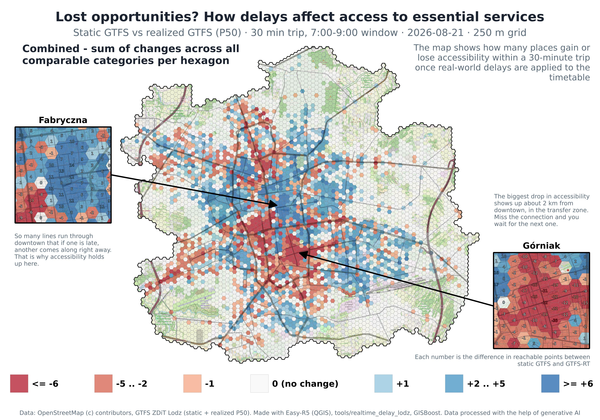

# realtime_delay_lodz — where GTFS-RT delays hurt reachability the most



**Question:** where in the city do real-world transit delays most degrade public-transport
reachability? Answered by comparing accessibility computed on the *static* GTFS schedule
against the *realized P50* schedule (the median of what vehicles actually did), for the
same real day, on the same network otherwise.

**Entirely on Easy-R5's own Processing algorithms** (`easyr5:buildnetwork`,
`easyr5:populationoverlay`, `easyr5:runaccessibility`) + native QGIS algorithms + stdlib.
No R/r5r, no Overpass API call at runtime, no pip — a dogfooding exercise, unlike
`../accessibility_lodz/` (R + r5r + Overpass) which this folder deliberately does not
depend on except for read-only, already-downloaded input files.

## Metric

For each hexagon (run at **250 m** and, separately, at **500 m** — see below) and each
of 4 destination categories, count how many points of that category are reachable
within **30 minutes**, departing in the **07:00–09:00** morning window
(`TIME_WINDOW=120`, `DEPARTURE_TIME=07:00` — the algorithm's own defaults), median
(P50) travel time. Run this once on the static network, once on the realized-P50
network, same day (**2026-08-21**). `delta_<category> = realized - static` — negative
means delays make fewer points of that category reachable.

Categories: **school** (`amenity=school`, not kindergarten), **pharmacy**
(`amenity=pharmacy`), **university** (curated OSM extract, reused from
`accessibility_lodz/lodz_universities.csv`), **mall** (`shop=mall`).

**Zero-baseline hexagons are excluded, not zeroed.** A hexagon where the *static*
schedule already reaches 0 points of a category within 30 min has `delta = 0-0 = 0`
too, but that is not "unaffected by delays" — it is "nothing to lose or gain in the
first place", and counting it as a real zero dilutes the signal with the city's
outskirts, which is mostly all-zero for schools/pharmacies/universities/malls at a 30
min cutoff. `delta_<category>` is `NULL` wherever the static count was 0, and
`base0_<category>` (1/0) flags those hexagons explicitly in the layer.

**`base_<category>`** is the plain-language version of the same thing: the actual
*baseline* — how many points of that category are reachable within 30 min under the
regular, unmodified static GTFS schedule (i.e. exactly `acc_srv_<category>_p50_c30`
from the static `RunAccessibility` run, copied onto `hex_delay`). `base0_<category>` is
nothing more than "is `base_<category>` equal to 0?" as a 0/1 flag — if `base_school = 0`
for a hexagon, there simply are no schools reachable in 30 min under the *normal*
timetable there, delays or not, which is why `delta_school` is `NULL` rather than a
number for that hexagon. Read `base_<category>` first if `base0_<category>` alone isn't
clear enough.

## Legend: manual, zero-isolated classes — not automatic equal-interval/quantile

`delta` is a small integer with a genuinely meaningful zero, and the distribution is
heavily zero-inflated with a long thin tail — e.g. 250 m `delta_school`: 2361 of 3867
comparable hexagons are exactly 0, but the range runs out to -14 and +10. QGIS's
automatic classifiers (equal interval, quantile) don't know that 0 is special, so a
"7 classes, equal interval" scheme puts a wide band like **[-2, +2] in one bucket** —
"no change" and "lost 2 opportunities" get painted the same colour, exactly the
ambiguity that prompted this section. **The fix is a manual classification that gives 0
its own singleton class**, built in `style_delay_layers.py` as an explicit
`QgsGraduatedSymbolRenderer` (the `mcp__qgis__set_layer_style` tool only offers
automatic classing, so this one needs a few lines of `QgsRendererRange` instead — same
pattern as the earlier `QgsVectorLayerJoinInfo` workaround in `modal_complementarity_lodz`):

| class | `delta_<category>` | `net_delta` | colour (ColorBrewer RdBu-7) |
|---|---|---|---|
| 1 | ≤ -4 | ≤ -6 | `#b2182b` dark red |
| 2 | -3 .. -2 | -5 .. -2 | `#d6604d` red |
| 3 | -1 | -1 | `#f4a582` pale red |
| 4 | **0 (no change)** | **0 (no change)** | `#f7f7f7` pale grey — deliberately *present*, not blank |
| 5 | +1 | +1 | `#92c5de` pale blue |
| 6 | +2 .. +3 | +2 .. +5 | `#4393c3` blue |
| 7 | ≥ +4 | ≥ +6 | `#2166ac` dark blue |

Two different things now look different, on purpose:
- **NULL** (`base0_<category>=1`, no baseline to compare) gets **no symbol at all** —
  fully transparent, verified directly (`renderer.symbolForFeature()` on 500 known-NULL
  features all returned `None`). This reads as "not applicable here."
- **Exactly 0** gets the pale grey `#f7f7f7` fill *with* a thin outline — present,
  comparable data that happens to show no change. This reads as "checked, no change" —
  visually distinct from both "not applicable" (blank) and "small real change" (light
  red/blue), which was the actual ask: stop hiding a real ±1 or ±2 inside the same bucket
  as "nothing happened."
- Class edges are placed at half-integers (e.g. `-3.5`, not `-4` or `-3`) so an integer
  delta can never land exactly on a boundary — no off-by-one ambiguity.

`styles/hex_delay-delta_school-base.qml` and `styles/hex_net_opportunities-base.qml` are
saved as editable starting points — swap the classified field in Symbology to reuse the
same 7 classes/colours for `delta_pharmacy`/`delta_university`/`delta_mall`.

## Hero layer: `hex_net_opportunities` — one number, gains vs. losses

A single map answering "here you lose this many opportunities, here you gain that many"
needs one number per hexagon, not four separate category layers. `hex_net_opportunities`
(written by `compute_delay.py` into the same gpkg) has just `hex_id`, `pop_total`,
`net_delta`, `net_delta_n`:

- `net_delta` = **sum of `delta_<category>` over whichever categories are comparable**
  for that hexagon (categories with a zero static baseline are skipped, not zeroed —
  same principle as `base0` above, just summed across categories instead of applied to
  one). `NULL` only when *none* of the 4 categories had a baseline there.
- `net_delta_n` (0-4) records **how many** categories went into the sum, so a hexagon
  comparable on all 4 categories isn't visually equated with one comparable on only 1 —
  check this field before reading too much into an extreme `net_delta` from a single
  category swamping the sum.
- Styled with the same manual, zero-isolated approach as above, wider bins (`net_delta`
  ranges roughly ±35 vs. ±19 for a single category) — see the table above.

Real numbers (2026-08-21): 250 m — pop-weighted mean net_delta **-0.311**
(4177/5662 hexagons had ≥1 comparable category, 2075 netted exactly 0); 500 m —
**+0.118** (1076/1479, 537 netted exactly 0). The sign flip matches the per-category one
below (250 m vs 500 m) — `net_delta` inherits it since it's a sum of the same numbers.

## Data reused from prior sessions (nothing new downloaded)

| Input | Source |
|---|---|
| `.osm.pbf` | `../accessibility_lodz/lodz.osm.pbf` |
| GTFS static, 2026-08-21 | `../accessibility_lodz/lodz_static_gtfs_2026-08-21.zip` |
| GTFS realized P50, 2026-08-21 | `../accessibility_lodz/lodz_realized_2026-08-21_p50.zip` |
| Population per census precinct | `../ses_income_lodz/lodz.gpkg` layer `obwody_spisowe`, field `population` (real GUS count, not the income-index proxy also in that file) |
| Universities | `../accessibility_lodz/lodz_universities.csv` |

Verified directly (zipfile inspection) before building anything: both GTFS zips map
2026-08-21 to the identical `service_id` (`11493_11`) with the **identical 9893-trip
`trip_id` set** — the realized feed is a rewritten timetable for the same trips, not a
different set of runs. This is the hard prerequisite for the comparison to mean anything.

Want to reproduce this by hand, in the Processing Toolbox, with no Python and no MCP —
just the plugin's own algorithms? See [`HOWTO_MANUAL.md`](HOWTO_MANUAL.md).

## Pipeline (`mcp__qgis__execute_code`, in order)

All three scripts are parametrized by hex resolution so the same pipeline runs at both
250 m (the default) and 500 m into separate files, without rebuilding the two networks
(they don't depend on hex size — R5's own cache makes a second `buildnetwork` call for
the same `.osm.pbf`+GTFS instant) or re-extracting `poi_targets` from scratch:

```python
# 250 m (default)
prepare_data.main()
run_accessibility.main()
compute_delay.main()

# 500 m
prepare_data.main(hex_spacing_m=500, out_gpkg=prepare_data.HERE / "delay_lodz_500m.gpkg")
run_accessibility.main(gpkg=run_accessibility.HERE / "delay_lodz_500m.gpkg", out_suffix="_500m")
compute_delay.main(gpkg=compute_delay.HERE / "delay_lodz_500m.gpkg", out_suffix="_500m")
```

1. **`prepare_data.py`** — builds `network_static/` and `network_realized_p50/` (same
   `.osm.pbf`, separate GTFS folders — the project's "one variant per build dir" rule);
   a hexagon grid (`native:creategrid`) clipped to the dissolved `obwody_spisowe`
   boundary, with population via `easyr5:populationoverlay`; and `poi_targets` —
   school/pharmacy/mall extracted straight from `lodz.osm.pbf`'s `points` and
   `multipolygons` OGR layers (`other_tags` filter on points, dedicated `amenity`/`shop`
   columns on multipolygons), polygon centroids preferred over a co-located point to
   avoid double-counting a building mapped both ways, university loaded from the
   existing CSV. Writes `delay_lodz.gpkg` (or `delay_lodz_500m.gpkg`) with `hex_grid`,
   `hex_centroids`, `poi_targets`.
2. **`run_accessibility.py`** — two `easyr5:runaccessibility` runs (static, realized_p50),
   `OPPORTUNITY_FIELDS = [srv_school, srv_pharmacy, srv_university, srv_mall]`,
   `CUTOFFS=30`, everything else left at the algorithm's defaults (07:00, 120 min window,
   P50, TRANSIT+WALK, STEP decay, lossless `MAX_WALK_TIME`). Resumable via a
   `.params.json` sidecar per case, same pattern as `../modal_complementarity_lodz/run_modal_cases.py`.
3. **`compute_delay.py`** — `delta_<category> = acc_realized - acc_static` per hexagon
   (`NULL` where the static count was 0 — see above), writes layer `hex_delay`
   (`hex_id`, `pop_total`, 4× `delta_<category>` + `base0_<category>`) plus the
   single-number hero layer `hex_net_opportunities` (see below) into the same gpkg,
   plus `out/city_delay_summary.csv` / `_500m.csv` and `out/city_net_summary.csv` /
   `_500m.csv` (population-weighted means, computed only over comparable hexagons).
4. **`style_delay_layers.py`** — not part of the data pipeline, applies the manual
   zero-isolated classification (see "Legend" below) to a `delta_<category>` or
   `net_delta` layer already loaded in the project.

## Real numbers from the verified run (2026-08-21)

- Hex grid: 5662 hexagons (250 m), 5631 with `pop_total > 0`; population overlay off by
  0.034% vs the precinct sum (18 precincts excluded, GUS-suppressed `population=NULL`).
- POI counts: 311 schools, 350 pharmacies, 47 universities, 58 malls.
- Population-weighted city-wide mean `delta`, **excluding zero-baseline hexagons**
  (realized P50 minus static, points reachable within 30 min, 07:00-09:00):
  **school -0.131** (3867/5662 hexagons comparable, 1795 excluded), **pharmacy -0.081**
  (3725, 1937 excluded), **university -0.003** (1092, 4570 excluded — most of the city
  is simply >30 min from any university regardless of delays), **mall -0.113** (2158,
  3504 excluded). Before excluding zero-baseline hexagons the naive means looked
  smaller and, for university, had the wrong sign (+0.009 vs the correct -0.003) —
  exactly the noise those hexagons were adding. Per-hex range is much wider than the
  city mean (e.g. `delta_school` from -14 to +10); the worst losses visually concentrate
  in the dense city-centre network, where more transfers make delays compound.
- **Note on running this**: `run_accessibility.py`'s two `RunAccessibility` passes
  (5662 origins here, vs. 1479 in `modal_complementarity_lodz`) took long enough that a
  single `mcp__qgis__execute_code` call timed out on the MCP transport and reported
  "failed" — QGIS itself kept computing in the main thread (it is unresponsive by design
  during a script, per the tool's own docs) and both runs finished correctly regardless.
  Check `out/*.params.json` exists for both cases before assuming a real failure and
  re-running from scratch.

## 250 m vs 500 m — resolution matters, and not just in magnitude

Same networks, same POI, same day, same everything except hex size. `delay_lodz_500m.gpkg`
has 1479 hexagons (492 with `pop_total = 0`, all excluded automatically same as at 250 m).

| category | 250 m mean delta (comparable / excluded) | 500 m mean delta (comparable / excluded) |
|---|---|---|
| school | **-0.131** (3867 / 1795) | **+0.061** (992 / 487) |
| pharmacy | **-0.081** (3725 / 1937) | **+0.155** (941 / 538) |
| university | **-0.003** (1092 / 4570) | **-0.018** (281 / 1198) |
| mall | **-0.113** (2158 / 3504) | **-0.097** (546 / 933) |

**School and pharmacy flip sign between resolutions.** This is not a bug — it's a real
instance of the modifiable areal unit problem (MAUP): a coarser hexagon's centroid can
land on a different street/stop than a finer one, and R5's step-cutoff accessibility is
sensitive to exactly which side of the 30-minute threshold a trip falls on. With ~4x
fewer, larger hexagons at 500 m, individual origin placement matters more and averages
out differently. **Practical takeaway: don't quote a single-resolution number as "the"
city-wide effect** — report both, or note the resolution explicitly, the way `docs/notes/`
already asks for `[verify]`-tagged claims to be checked rather than assumed. University
and mall (fewer POI, so most hexagons are `base0`-excluded either way) are more stable in
sign and in the same order of magnitude across resolutions.

## What Michał can check by hand in QGIS

- `hex_delay` in `delay_lodz.gpkg` (250 m) and `delay_lodz_500m.gpkg` (500 m), styled
  per category with a diverging ramp centred on 0 (red = fewer reachable points because
  of delays) — one map per category, no print layout needed.
- `out/city_delay_summary.csv` and `out/city_delay_summary_500m.csv` for the city-wide,
  population-weighted picture at each resolution — and whether the sign flip above still
  looks right to you, or whether it's worth digging into which specific hexagons drive it.
- If a category's `delta` distribution looks suspicious (all zero, all NULL, an absurd
  magnitude), that is very likely a parameter or data problem, not a real result — say so
  before trusting it.

## Web version: `mapy-analizy/opoznienia-dostepnosc`

`export_geojson.py` re-projects `hex_delay` + `hex_net_opportunities` (both resolutions) to
EPSG:4326 and writes them straight into the sibling `mapy-analizy` repo's
`opoznienia-dostepnosc/data/` — same manual re-export pattern as that repo's other analyses.
It also exports two reference overlays used only on the web page, not in the metric itself:
`boundary.geojson` (the dissolved city outline, resolution-independent) and
`siatka_<res>.geojson` (hex_id + geometry only, no attributes) — an outline-only grid that
stays visible even over hexagons the choropleth filters out as null, mirroring the
`boundary`/`siatka` layers added directly to `delay_lodz.gpkg` / `delay_lodz_500m.gpkg` for
Michał's own print atlas. See `mapy-analizy/opoznienia-dostepnosc/README.md` for the page
itself; re-run `export_geojson.py` and refresh that repo's `data/` whenever the local pipeline
output changes (manual, no CI).

## A chart for the print board: `chart_distance_delta.py`

A bar chart to sit next to the maps: population-weighted mean `net_delta` by distance from
the **population-weighted centroid of all hexagons** (not a guessed CBD point — see
`_population_centre()`), binned every 1 km, one bar per resolution. Bar colour reuses
`style_delay_layers.RDBU7`/`classify()` exactly — same 7-class, zero-isolated legend as the
maps and the web version, so a reader who has seen either does not have to learn a new scale.
Each bar is labelled with its `n` (⚠ under `MIN_N_WARN=20`, so a thin bin cannot be read as
confidently as a thick one just because it is drawn the same size).

Rendering conventions (Agg backend before `pyplot`, thin recessive grid, a wrapped caption
under the axes carrying provenance/caveats, every figure shipping `<prefix>.png` +
`<prefix>.csv` of the exact plotted values + `<prefix>.json` with params and a source SHA-256)
are copied from `easy-OTP/tools/transit_charts`'s `render/style.py` — a sibling project's
chart tooling, **copied, not imported** (the same "copy, don't depend across projects" rule
`CLAUDE.md` applies to plugin code applies here).

**Real result (2026-08-21, both resolutions): no clean "worse toward the centre" gradient.**
Instead, a sharp, resolution-robust dip at **2-3 km from the population centre**
(pop.-weighted mean net_delta ≈ **-2.43** at 250 m, n=295; **≈ -2.05** at 500 m, n=70) — an
order of magnitude worse than every other 1 km ring, which mostly sit within ±0.5. The
innermost ring (0-1 km) is mildly *positive* at both resolutions. Read literally: delays don't
punish "the centre" uniformly, they punish a specific ring a bit further out — plausibly where
transfer-dependent trips are common but the network has less slack than in the very core.
Worth digging into which routes/hexagons drive that ring before quoting it as an explanation,
not just a measurement. Outputs: `out/charts/distance_vs_net_delta_{250,500}m.{png,csv,json}`.

## Print boards

Full B2 print-layout renders (hero map + two zoomed-in insets + the 4 per-category
maps + a side chart), Polish and English, built in QGIS from `delay_lodz.qgz`:
see [`out/boards/`](out/boards/) for both.
