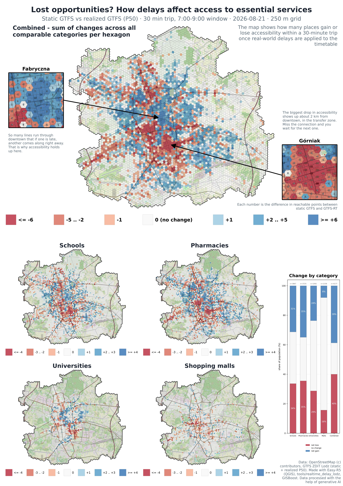

# Print boards

Full B2 (500x707 mm) print-layout renders built in QGIS from this analysis's
`delay_lodz.qgz` -- hero map, two zoomed-in insets (city centre vs. the
2-3 km transfer ring), the 4 per-category maps, and the `loss_gain_profile`
side chart. See the main [README](../../README.md) for the metric itself.

## Polish

## English

Both boards are the same QGIS layout (`plansza_mapy` / `plansza_mapy_en` in
`delay_lodz.qgz`) -- positions and map extents are identical, only the labels
are translated.
