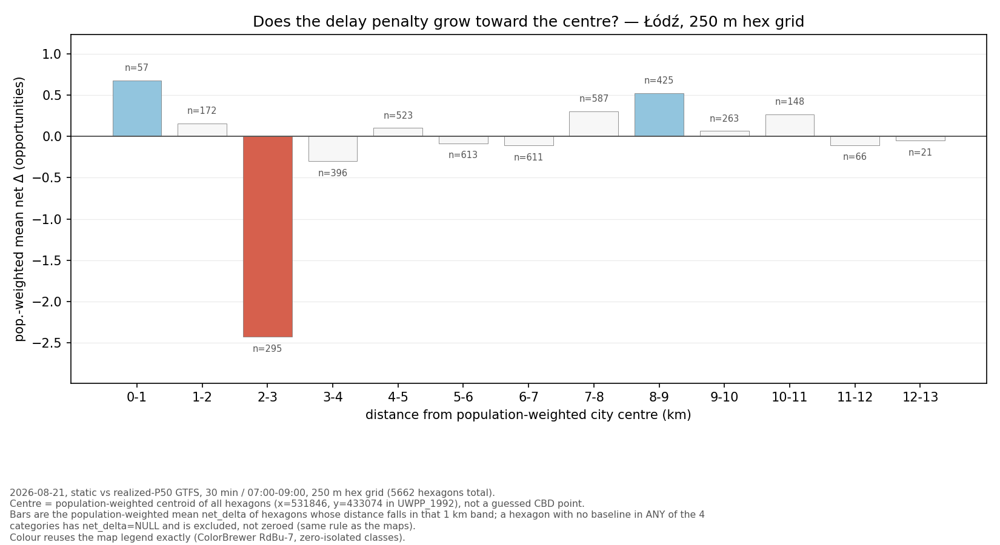
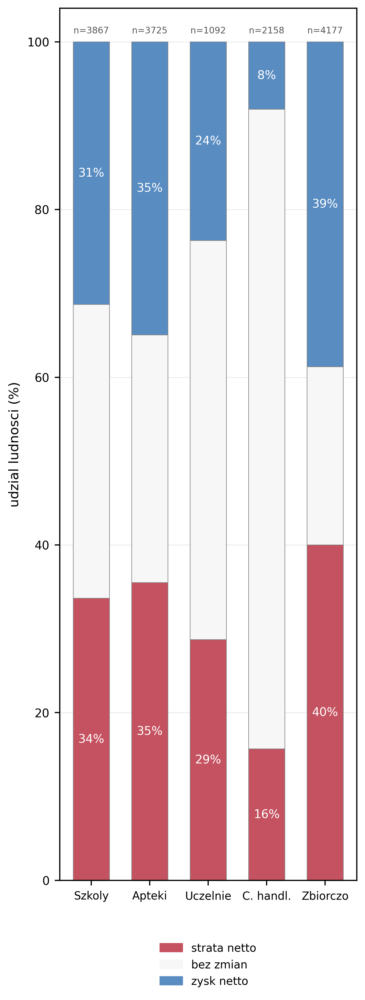
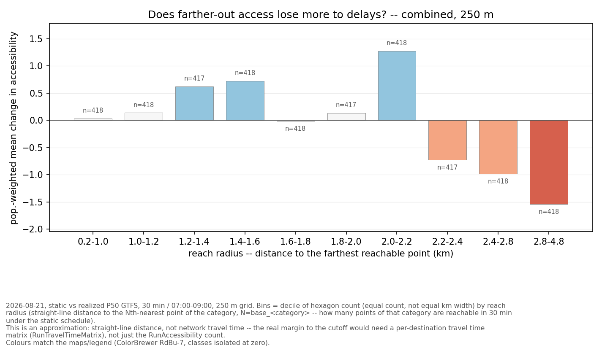
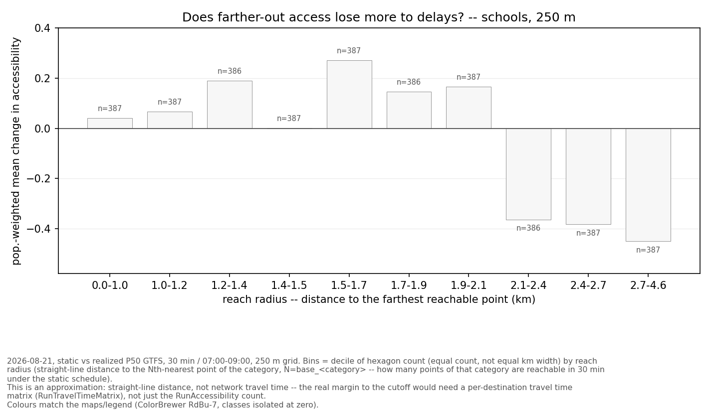

# Example charts

This folder is where `chart_distance_delta.py`, `chart_loss_gain_profile.py`
and `chart_reach_radius.py` write their output (`.png` + `.csv` + `.json`
triples, one per resolution/category). Most of it is regenerated locally and
not versioned -- only a handful of examples below are committed, so this page
has something to show without having to run the pipeline first.

## Does delay-driven loss track distance from the city centre?

Bar chart, 1 km bins from the population-weighted centre. See
`chart_distance_delta.py` and the main README's "distance from centre" note
for why the answer turned out to be "not really -- there's a sharp dip at
2-3 km instead of a smooth gradient".

## Who nets a loss, who nets a gain

100%-stacked column per category (+ combined), population living in hexagons
that net lose, stay unchanged, or gain reachable points. See
`chart_loss_gain_profile.py`.

## Does farther-out access lose more? (reach radius)

"Reach radius" = distance to the farthest point a hexagon can already reach
in 30 min (static schedule) -- a proxy for how close that hexagon is to the
30-minute cutoff, where a few seconds of delay is enough to drop a point out
of reach. See `chart_reach_radius.py` for the exact method and its caveats
(straight-line distance, not network travel time).

All other categories/resolutions (`pharmacy`, `university`, `mall`, and the
500 m grid) are generated the same way -- rerun the relevant `chart_*.py`
inside the QGIS Python environment to get them locally.
