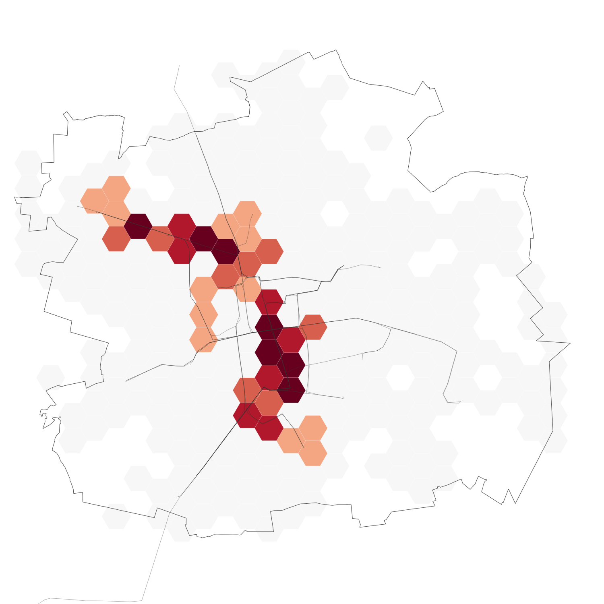
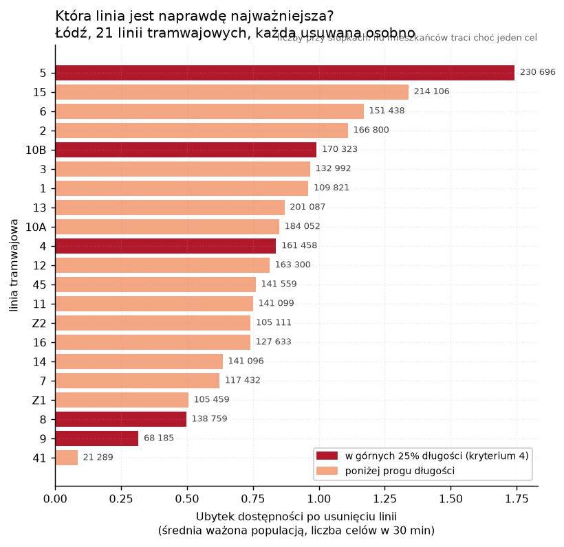
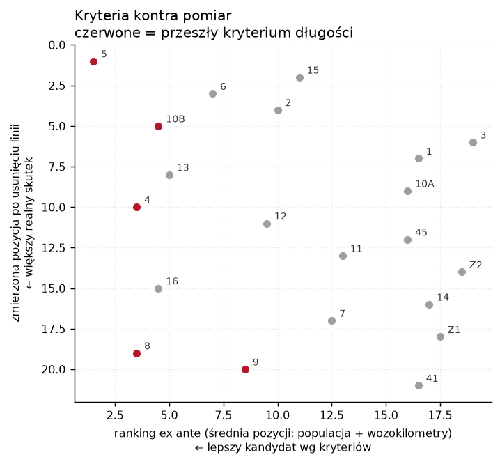
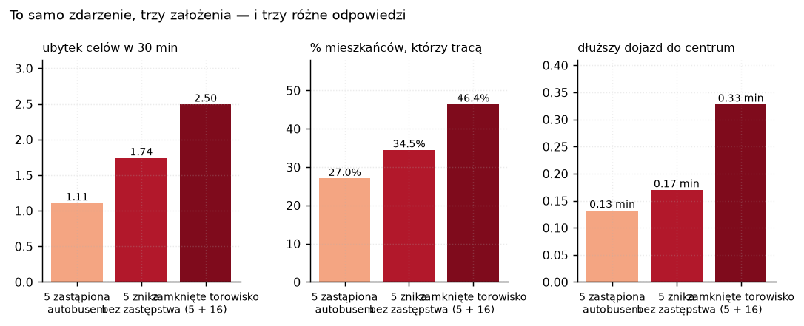
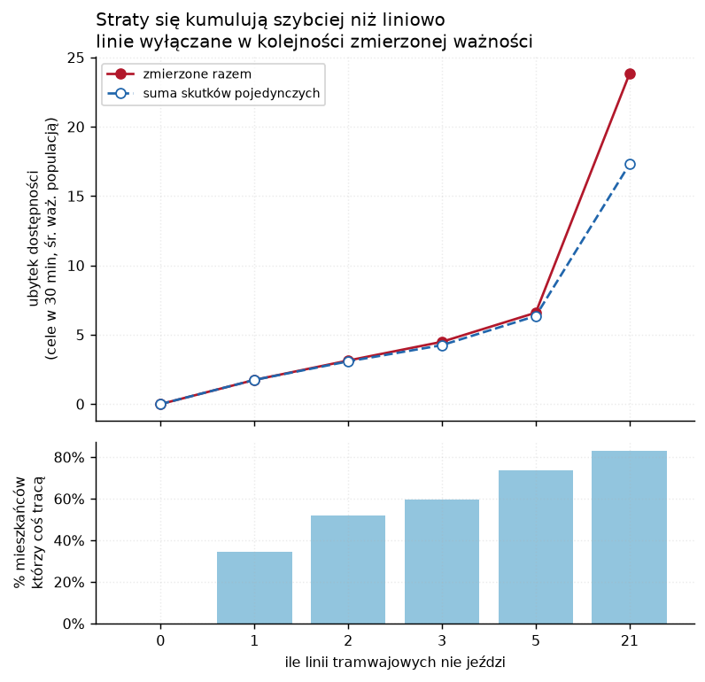
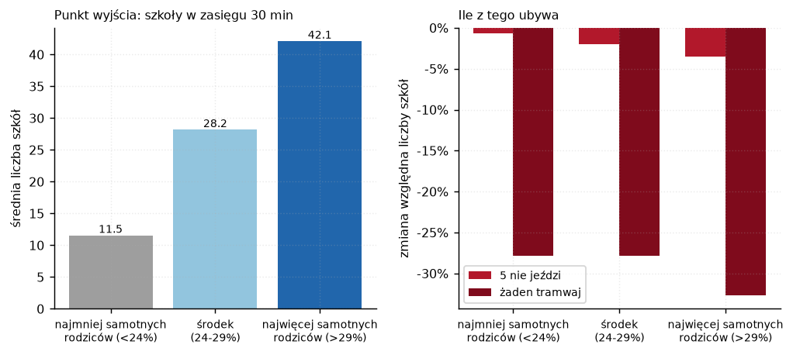

# tram_failure_lodz — co się stanie, gdy padnie najważniejsza linia tramwajowa

> **Narzędzie samodzielne.** Nie jest częścią wtyczki QGIS i nigdy nie jest importowane przez
> `easy_r5/`. Liczy **wyłącznie algorytmami Easy-R5 0.3.0** (`buildscenario`,
> `runaccessibility` z parametrem `SCENARIO`, `runtraveltimematrix`, `populationoverlay`,
> `summarizeaccessibilityequity`) plus natywne algorytmy QGIS i stdlib. Bez R, bez r5r,
> bez `pip install`.

**Pytanie:** o ile pogorszy się dostępność transportowa w Łodzi, gdy przestanie jeździć
najważniejsza linia tramwajowa — i czy da się z góry powiedzieć, która to linia.

**Odpowiedź w jednym zdaniu:** wyłączenie linii 5 odbiera dostęp do co najmniej jednego celu
**230 696 mieszkańcom (34,5 %)**, ale nikomu nie odbiera ostatniej szkoły ani apteki — w Łodzi
linie tramwajowe tak mocno się pokrywają, że awaria pojedynczej linii jest szokiem
częstotliwości i bezpośredniości, a nie szokiem zasięgu.



---

## 1. Jak wybrano linię

Kryteria wyjściowe brzmiały: linia tramwajowa (1), przechodząca przez centroid miasta ważony
populacją (2), z największym spowolnieniem między przystankami bliżej centrum (3), w górnych
25 % najdłuższych linii (4). Dwa z nich wymagały przeformułowania, żeby dały się zmierzyć.

| # | Kryterium jak sformułowane | Co z nim zrobiono | Dlaczego |
|---|---|---|---|
| 1 | tramwajowa | filtr; odpadają `R8` (2 kursy, 0 km — zjazd do zajezdni), `P1`, `P2` (po 10 kursów) | zostaje **21 linii** z realnym kursowaniem |
| 2 | przechodzi przez centroid ważony populacją | **populacja w promieniu 500 m od przystanków linii** | centroid ważony populacją to **jeden punkt** (19,4616 E, 51,7631 N). „Przechodzi przez punkt" nie różnicuje linii; populacja obsługiwana mierzy to samo w sposób ciągły |
| 3 | największe spowolnienie w centrum | **policzone i raportowane, ale nie punktowane** | patrz niżej |
| 4 | w górnych 25 % długości | filtr przy P75 = **15,91 km** | zostawione bez zmian — i to właśnie ono okazało się najsłabsze |
| 5 | *(dodane)* wozokilometry na dobę | punktowane na równi z (2) | żadne z czterech kryteriów nie mierzyło, ile linia faktycznie wystawia obsługi; bez danych o potokach pasażerskich to najbliższy dostępny proxy „obciążenia" |

**Dlaczego kryterium 3 wypadło z punktacji.** Linia 11 rzeczywiście ostro zwalnia po wjeździe do
centrum (20,5 → 13,7 km/h mediany prędkości segmentowej w szczycie, postoje wyłączone) — pamięć
z wcześniejszej analizy GTFS się potwierdza. Problem w tym, że **to nie jest miara obciążenia,
tylko warunków ruchu**, i ma silny confounder: w centrum przystanki stoją gęściej (433 m na 11
wobec ~500 m na obrzeżach), więc część spadku to hamowanie i ruszanie, a nie korek. Próba
kontroli tego efektu krzywą prędkość↔rozstaw przystanków z obrzeży dała krzywą niemonotoniczną
(429 m → 25,7 km/h, ale 500 m → 16,1 km/h), czyli kontrola jest niewiarygodna. Rzetelną wersję
tego kryterium daje `easy-OTP/tools/transit_charts` wykres **D17 („zapas w rozkładzie")**, który
liczy to na danych GTFS-RT i dla łódzkiej 11 wskazuje konkretnie segment 23 — ale to wymaga
danych czasu rzeczywistego, których ta analiza świadomie nie używa.

**Wynik: linia 5.** Pierwsza pod względem obsługiwanej populacji, druga pod względem
wozokilometrów, powyżej progu długości, z wyraźnym spadkiem prędkości w centrum.

| linia | pop. w 500 m | % ludności miasta | wozokm/dobę | dł. [km] | spadek prędkości |
|---|---|---|---|---|---|
| **5** | **203 829** | 30,4 % | 2 542 | 17,40 | 4,6 km/h |
| 4 | 196 406 | 29,3 % | 2 066 | 19,24 | 8,1 km/h |
| 16 | 187 069 | 27,9 % | 1 863 | 14,09 | 1,7 km/h |
| 8 | 175 133 | 26,1 % | 2 473 | 16,96 | −1,7 km/h |
| 10B | 135 104 | 20,2 % | **3 192** | 16,69 | 5,7 km/h |
| 11 | 119 196 | 17,8 % | 1 302 | 14,74 | 6,0 km/h |

Linia 11 nie przechodzi kryterium 4 (14,74 km < 15,91 km) i jest dopiero szósta pod względem
obsługiwanej populacji.

Przy okazji liczba, która sama w sobie jest wynikiem: **70,2 % mieszkańców Łodzi mieszka
w promieniu 500 m od przystanku tramwajowego.**

## 2. Czy kryteria trafiły — test przez wyłączanie po kolei

Wybór linii na podstawie kryteriów jest założeniem. Żeby zamienić je w wynik, **każda z 21 linii
została usunięta osobno** i zmierzona tym samym miernikiem. Przy siatce 1000 m (394 heksy)
jeden przebieg R5 trwa ~12 s, więc pełny leave-one-out kosztuje pięć minut.



**Linia 5 wychodzi najgorsza również w pomiarze.** Kryteria trafiły zwycięzcę.

**Ale poza pierwszym miejscem trafiają słabo.** Korelacja rang Spearmana między oceną ex ante
a zmierzonym skutkiem to zaledwie **+0,25**, a dla samej długości linii **+0,07** — czyli
praktycznie zero.



- Linia **15** jest druga w pomiarze, a była **jedenasta** wg kryteriów — i **odpadłaby na
  kryterium 4** (12,93 km).
- Linia **6** jest trzecia w pomiarze, też poniżej progu długości.
- Linia **8** była trzecia wg kryteriów, a w pomiarze jest **dziewiętnasta** na 21.
- Pięć linii, które przeszły kryterium długości, zajmuje w pomiarze miejsca 1, 5, 10, 19 i 20.

**Wniosek metodyczny: długość linii jest dla tego pytania miarą bezużyteczną.** Liczy się, ile
ludzi linia obsługuje i czy ma dublera na swojej trasie — a nie ile ma kilometrów.

## 3. Dlaczego pojedyncza linia nie odbiera nikomu tramwaju

Żadna z 21 linii nie ma ani jednego przystanku, którego nie obsługuje inna linia tramwajowa
(kolumna `pop_exclusive` w `out/tram_lines.csv` — zera dla wszystkich lin głównych). Linia 5
dzieli **77 % przystanków z 16** i **52 % z 4**.

Widać to w wynikach: w żadnym scenariuszu z jedną usuniętą linią **ani jeden mieszkaniec nie
traci ostatniej szkoły ani ostatniej apteki w zasięgu 30 minut**. Ubytek to mniej kursów, dłuższe
oczekiwanie i więcej przesiadek — a nie brak obsługi. Dlatego miarą jest dostępność liczona
przez R5, a nie bufor wokół przystanków.

Po usunięciu linii 5 **161 905 mieszkańców** traci przynajmniej jedno połączenie **bezpośrednie**
(przebieg z `MAX_RIDES=1`, czyli „bez przesiadki") — to dwie trzecie wszystkich, którzy tracą
cokolwiek.

## 4. „Padła" znaczy trzy różne rzeczy



| scenariusz | co znika | ubytek celów w 30 min | traci mieszkańców | dojazd do centrum |
|---|---|---|---|---|
| **autobus zastępczy** | 5 znika, w jej miejsce autobus tą samą trasą, 12,4 km/h zamiast 15,5, co 7,5 min | −1,11 | 180 880 (27,0 %) | +0,13 min |
| **5 znika bez zastępstwa** | kursy linii 5 przestają istnieć | −1,74 | 230 696 (34,5 %) | +0,17 min |
| **zamknięte torowisko (5 + 16)** | wszystkie linie na wspólnym odcinku | −2,50 | 310 464 (46,4 %) | +0,33 min |

**Autobus zastępczy odrabia 36,3 % straty.** To liczba dla decyzji operacyjnej: uruchomienie
komunikacji zastępczej o tej samej częstotliwości, wolniejszej o 20 %, cofa ponad jedną trzecią
skutku — ale tylko jedną trzecią.

Scenariusz torowiska jest jedynym, który **komukolwiek odbiera ostatni cel**: 4 586 mieszkańców
traci dostęp do jakiejkolwiek uczelni w 30 minut.

## 5. Kaskada — co, jeśli padnie więcej

Linie wyłączane w kolejności **zmierzonej** ważności (5, 15, 6, 2, 10B), nie w kolejności
kryteriów.



| ile linii nie jeździ | ubytek celów | traci mieszkańców | dojazd do centrum |
|---|---|---|---|
| 1 (5) | −1,74 | 230 696 (34,5 %) | +0,17 min |
| 2 (+15) | −3,14 | 346 564 (51,8 %) | +0,28 min |
| 3 (+6) | −4,49 | 398 789 (59,6 %) | +0,29 min |
| 5 (+2, 10B) | −6,59 | 492 763 (73,7 %) | +0,93 min |
| **21 (wszystkie)** | **−23,83** | **556 839 (83,2 %)** | **+9,45 min** |

Do pięciu linii straty **niemal się sumują** (−6,59 zmierzone wobec −6,35 przewidywanych
z sumy pojedynczych skutków, +3,8 %). Ponadaddytywność pojawia się dopiero przy rozpadzie
całej sieci: −23,83 wobec −17,31 z sumowania, czyli **o 38 % więcej, niż wynikałoby z dodawania**.
Póki zostaje choć szkielet tramwajowy, sieć amortyzuje utratę pojedynczych linii; gdy szkielet
znika, autobusy nie są w stanie przejąć roli.

Bez tramwajów **90 914 mieszkańców** traci dostęp do jakiejkolwiek uczelni w 30 minut,
**48 114** do galerii handlowej, a **4 828** nie dojedzie do centrum miasta nawet w 90 minut.

## 6. Kto traci

Podział równościowy **nie jest** po dochodzie. `income_index_pln` ze spisu rozciąga się w Łodzi
od 2 980 do 3 125 zł przy odchyleniu standardowym 21 zł na 3 854 obwody — tercyle takiej zmiennej
rozdzieliłyby grupy różnicą 13 zł, czyli niczego. **To samo w sobie jest ustaleniem:** na tym
wskaźniku nie da się w Łodzi zrobić analizy równościowej.

Grupowanie idzie więc po **udziale rodzin samotnych rodziców** (`fam_pct_matki_samotne`, 16–41 %),
który ma realny rozrzut i jest dobrym markerem gospodarstwa bez samochodu w rezerwie. Tercyle
liczone **po ludziach**, nie po heksach: każda grupa to około jedna trzecia mieszkańców miasta.



Kierunek jest odwrotny do intuicji i wart podkreślenia: w Łodzi rodziny samotnych rodziców
mieszkają **w dobrze obsłużonym centrum**, nie na obrzeżach.

| tercyl | szkoły w 30 min (stan wyjściowy) | strata: 5 nie jeździ | strata: żaden tramwaj |
|---|---|---|---|
| najmniej samotnych rodziców (<24 %) | 11,5 | −0,08 (−0,7 %) | −3,21 (−27,9 %) |
| środek (24–29 %) | 28,2 | −0,56 (−2,0 %) | −7,83 (−27,8 %) |
| najwięcej samotnych rodziców (>29 %) | **42,1** | **−1,47 (−3,5 %)** | **−13,76 (−32,7 %)** |

Grupa najbardziej zależna od transportu zbiorowego ma najwyższy punkt wyjścia **i** ponosi
największą stratę — bezwzględną i względną. Gini dostępności do szkół wynosi 0,376 dla całego
miasta, ale 0,415 w tercylu o najniższym udziale samotnych rodziców: peryferie są
nierównomierne same w sobie.

## 7. Dane i metoda

| Wejście | Źródło |
|---|---|
| sieć R5 | `../realtime_delay_lodz/network_static/` — **nie przebudowywana**, R5 stosuje scenariusz w pamięci |
| GTFS statyczny 2026-08-21 | `../accessibility_lodz/lodz_static_gtfs_2026-08-21.zip` (piątek, 1 `service_id`) |
| ludność | `../ses_income_lodz/lodz.gpkg`, warstwa `obwody_spisowe`, pole `population` (GUS NSP 2021) |
| cechy społeczne | ta sama warstwa: `fam_pct_matki_samotne`, `hh_pct_jednoosobowe`, `hh_avg_size`, `income_index_pln` |
| cele (766) | `../realtime_delay_lodz/delay_lodz.gpkg`, warstwa `poi_targets` — 311 szkół, 350 aptek, 47 uczelni, 58 galerii |

**Miara.** Dla każdego heksa liczba celów każdej kategorii osiągalnych w **30 minut**, odjazd
**07:00**, okno **120 minut**, mediana (P50), TRANSIT + WALK — dokładnie te same ustawienia co
w `../realtime_delay_lodz`, więc obie analizy czyta się obok siebie.

**Siatka 1000 m**, 394 heksy, 669 027 mieszkańców (0,14 % różnicy wobec sumy z obwodów).

**Heksy o zerowym punkcie wyjścia są wykluczane, nie zerowane.** Heks, który i tak nie dociera
do żadnej szkoły w 30 minut, ma po usunięciu linii deltę 0 — ale to znaczy „nie miał czego
stracić", a nie „awaria go nie dotknęła". Wliczanie takich zer rozcieńcza każdą średnią miejską
obrzeżami. Delta jest tam `NULL`.

**Ważenie populacją** wszędzie: heks to pojemnik na ludzi, nie głos.

Trzy metryki, bo „jak bardzo było źle" ma trzy różne odpowiedzi:
`acc` (cele w 30 min), `centre` (czas dojazdu do centroidu ważonego populacją — macierz
1-do-wielu), `direct` (ten sam przebieg co `acc`, ale z `MAX_RIDES=1`, czyli bez przesiadki —
tak ta analiza mierzy utratę połączeń bezpośrednich, bo macierz R5 nie raportuje liczby
przesiadek, a `MAX_RIDES` załatwia to samo bez ruszania runnera w Javie).

Łącznie **43 przebiegi R5**, każdy wznawialny przez plik `.params.json` obok wyniku.

## 8. Czego ta analiza nie mówi

- **Nie modeluje pojemności ani potoków pasażerskich.** GTFS ich nie zawiera. Wozokilometry to
  proxy podaży, nie popytu. Zatłoczenie autobusu zastępczego nie istnieje w tym modelu.
- **Scenariusz „zamknięte torowisko" to górne oszacowanie**: usuwa linie 5 i 16 na całej
  długości, podczas gdy w rzeczywistości stanęłyby tylko kursy przez zamknięty odcinek,
  a reszta zostałaby skrócona lub objazdowa.
- **Siatka 1000 m jest zgrubna.** Dostępność liczona jest z jednego centroidu na heks
  o powierzchni ~0,87 km², który reprezentuje do ~1 700 osób. Kierunki i rankingi są odporne,
  ale wartości bezwzględne przy siatce 250 m byłyby inne (patrz rozdział „250 m vs 500 m"
  w `../realtime_delay_lodz/README.md` — tam zmiana rozdzielczości potrafiła odwrócić znak
  miejskiej średniej).
- **Jeden dzień, jedno okno.** Piątek 2026-08-21, szczyt poranny. Awaria w sobotę wieczorem
  wygląda inaczej.
- **Autobus zastępczy jedzie po linii prostej między przystankami** — tak `BuildScenario`
  modeluje nową linię. Dla trasy tramwajowej, która i tak biegnie mniej więcej prosto, błąd jest
  niewielki, ale nie zerowy.

## 9. Cztery siatki i MAUP

> **Stan: liczby wyżej pochodzą z pilota na siatce 1000 m.** Pełny przebieg na czterech
> siatkach jest przygotowany, ale jeszcze nie policzony do końca — po nim liczby
> w rozdziałach 1–6 zostaną odświeżone z siatki 250 m, a rozdział o MAUP wypełniony.

Wynik policzony na heksach zależy od tego, jak te heksy narysowano — to *modifiable areal
unit problem*. Ma dwie połowy i testowanie tylko jednej to połowa roboty:

| siatka | heksów | co testuje |
|---|---|---|
| `h250` | 5 665 | **skala** — siatka raportowa, najdrobniejsza |
| `h500` | 1 477 | skala |
| `h1000` | 396 | skala |
| `h500off` | 1 479 | **zonowanie** — te same komórki 500 m, przesunięte o pół komórki |

Bez `h500off` nie da się odróżnić „liczby się ruszyły, bo agregowałem" od „liczby się
ruszyły, bo akurat tak poprowadziłem linie".

Jednostką raportowania są **36 osiedli Łodzi** (jednostki pomocnicze z OSM,
`admin_level=11`): Górniak, Teofilów-Wielkopolska, Widzew-Wschód, Olechów-Janów… To
świadoma decyzja metodyczna — osiedla są **identyczne we wszystkich czterech siatkach**,
więc jeśli wynik na nich się zgadza, zdania w rodzaju „X % mieszkańców Górniaka traci…"
są odporne na MAUP nawet tam, gdzie liczby na heksach nie są. Nie walczymy z MAUP;
raportujemy na jednostkach, które coś znaczą, i pokazujemy, że są stabilne.

## 10. Dwa sposoby uruchomienia

Analiza dzieli się na część, która potrzebuje QGIS-a, i całą resztę. **Żaden moduł
`easy_r5/core/` nie importuje PyQGIS**, więc R5 da się pędzić samym Pythonem i Javą — i to
dlatego drogie liczenie może iść na GitHub Actions.

| krok | QGIS? | plik |
|---|---|---|
| ranking linii z GTFS | nie | `rank_lines.py` |
| siatki, populacja, cechy spisowe, osiedla | **tak** | `prepare_data.py` |
| zamrożenie siatek do CSV | **tak, raz** | `export_inputs.py` → `inputs/` (wersjonowane) |
| pliki scenariuszy | **tak** | `build_scenarios.py` |
| przebiegi R5 | nie | `ci_run.py` (CI) albo `run_cases.py` (w QGIS) |
| tabele, osiedla, równość | nie | `compute_impact.py` |
| MAUP, wykresy | nie | `maup.py`, `charts.py`, `maup_charts.py` |
| mapy | **tak** | `make_map.py` |

`ci_run.py` i `run_cases.py` dają **identyczne co do bajtu** pliki `acc_*.csv` —
sprawdzone na przypadkach `corridor` i `all_trams`.

### Na GitHub Actions

`.github/workflows/tram-failure-lodz.yml`, wyłącznie `workflow_dispatch`. Cztery siatki
to cztery równoległe zadania, więc czas to najwolniejsza z nich, nie ich suma. Runner
pobiera OSM z Geofabrika i przycina `osmosis`-em, GTFS bierze z release'u
`lodz-realized-2026-08-21-phone` w `easy-GTFS-RT`, a jar R5 z URL-a i sumy SHA-256
zapisanych w `easy_r5/core/pins.py`. Wyniki wychodzą jako artefakty per siatka plus
wspólny artefakt z wykresami.

Siatek CI **nie odtwarza** — stoją na danych spisowych GUS, których nie ma publicznie.
Dlatego `inputs/*.csv` są w repozytorium, tak samo jak
`tools/accessibility_cities/<miasto>/<miasto>_hex_{origins,ses}.csv`.

### Lokalnie

```python
# 1. ranking linii (zwykły Python)
py rank_lines.py

# 2. w konsoli Pythona QGIS-a — siatki, scenariusze, przebiegi, mapy
import sys; sys.path.insert(0, r"...	ools	ram_failure_lodz")
import run_all; run_all.main()

# 3. zwykły Python
py compute_impact.py && py maup.py && py charts.py
```

Wszystko jest wznawialne: przebieg, którego parametry się nie zmieniły, jest pomijany.
QGIS nie odpowiada w trakcie liczenia — to normalne; jeśli wywołanie MCP zgłosi timeout,
sprawdź `out/<siatka>/*.params.json`, zanim uznasz to za błąd.

Trzy sprawdziany bez QGIS-a: `py gtfs_lines.py`, `py impact.py`, `py maup.py`.

## 11. Gdzie co leży

```
tram_failure_lodz/
  inputs/          zamrożone siatki — WERSJONOWANE, to z nich czyta CI
  grids/           h250.gpkg h500.gpkg h1000.gpkg h500off.gpkg  (dane, gitignore)
  scenarios/       24+3 pliki scenariuszy, wspólne dla wszystkich siatek
  out/
    h250/ h500/ h1000/ h500off/   wyniki R5, tabele, osiedla, raporty równości
    maup/                          porównania między siatkami
    figures/                       01..05_<temat>_<siatka>.png, 06..08_mapa_*_<siatka>.png,
                                   10..12_maup_*.png (bez sufiksu — dotyczą wszystkich)
    tram_lines.csv selection.json scenarios.json   (niezależne od siatki)
```

Nazwy plików wynikowych zaczynają się od numeru, więc listing katalogu układa się
w kolejność opowieści, a sufiks mówi, z której siatki pochodzi dany obrazek.

### Dwie pułapki napotkane po drodze

1. **`easyr5:populationoverlay` przewraca się na niestandardowej elipsoidzie projektu.**
   Algorytm interpoluje przez `$area`, które idzie za elipsoidą **projektu**. Projekt
   `demo_v03_lodz.qgz` ma wpisaną `PARAMETER:6378137:6356752.31…`, dla której QGIS zwraca `NaN`
   na każdym obiekcie, a algorytm umiera na `Cannot convert 'nan' to double` wewnątrz
   `"population"/"area"` — komunikat daleki od przyczyny. `prepare_data.planimetric_area()`
   przestawia elipsoidę na `NONE` na czas przebiegu i przywraca ją po. Dla interpolacji
   powierzchniowej w układzie płaskim to i tak właściwa miara (liczy się wyłącznie stosunek
   części do całości).
2. **CRS warstwy spisowej nie ma kodu EPSG** (`UWPP_1992`, `srs_id` 100000). To ta sama
   przyczyna, tyle że wcześniej w łańcuchu. Warstwa jest przeetykietowana na EPSG:2180
   w pamięci (plik nietknięty), a `centre_layer()` przelicza centroid ważony populacją przez
   ten CRS i porównuje z niezależnym przeliczeniem w `gtfs_lines.py` — zgodność **2 m**
   potwierdza, że etykieta jest prawdziwa.
